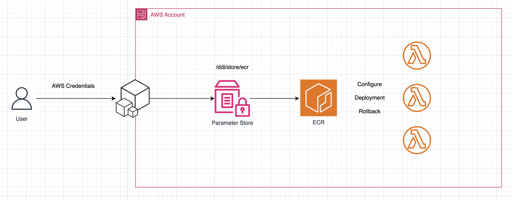

# DDL (Donggyu Driven Lambda)

## Architecture




## ...

```
    Thanks to K...
```

## lib

- golang-ci (brew)
- golines (extesions)
- run on save (extensions)
- <a href="https://github.com/samber/lo?tab=readme-ov-file"> lo </a>